Устанавливаем пакеты и читаем данные:


```python
import matplotlib.pyplot as plt
import numpy as np
import pandas as pd
import scipy.stats
import seaborn as sns
from scipy.stats.sampling import SimpleRatioUniforms
```


```python
data_India = pd.read_csv('/Users/danilshulgan/Desktop/DEV_India.csv', sep=';')
India = data_India['ConvertedCompYearly']/1000
data_France = pd.read_csv('/Users/danilshulgan/Desktop/DEV_France.csv', sep=';')
France = data_France['ConvertedCompYearly']/1000
data_Russia = pd.read_csv('/Users/danilshulgan/Desktop/DEV_RU.csv', sep=';')
Russia = data_Russia['ConvertedCompYearly']/1000
data_Canada = pd.read_csv('/Users/danilshulgan/Desktop/DEV_Canada.csv', sep=';')
Canada = data_Canada['ConvertedCompYearly']/1000
```

Оцениваем выборки


```python
def sample(data):
    print(data.describe())
    fig, ax = plt.subplots(1, 2, figsize=(12, 5))
    data.plot.hist(density=True, ax=ax[0])
    data.plot.density(ax=ax[0])
    data.plot.box(ax=ax[1])
```


```python
sample(Canada)
```

    count    1101.000000
    mean      100.473198
    std        48.780611
    min        20.616000
    25%        67.152000
    50%        89.797000
    75%       117.126000
    max       390.421000
    Name: ConvertedCompYearly, dtype: float64


    
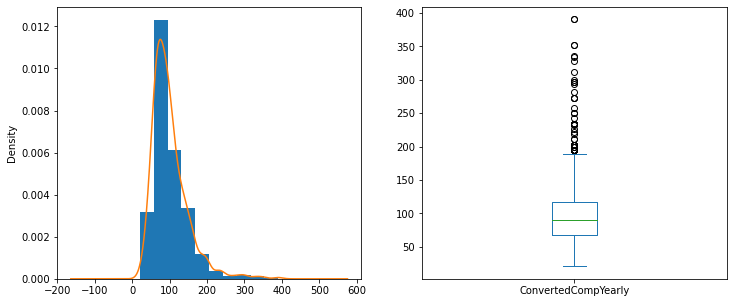
    


```python
sample(France)
```

    count    971.000000
    mean      54.019285
    std       23.597882
    min        3.009000
    25%       39.010500
    50%       48.624000
    75%       63.986000
    max      191.959000
    Name: ConvertedCompYearly, dtype: float64


    
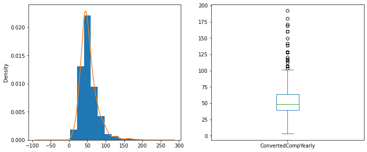
    


```python
sample(Russia)
```

    count    377.000000
    mean      44.398976
    std       26.939837
    min        1.248000
    25%       24.312000
    50%       39.480000
    75%       62.340000
    max      145.464000
    Name: ConvertedCompYearly, dtype: float64


    
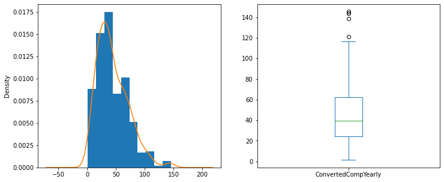
    


```python
sample(India)
```

    count    1674.000000
    mean       23.367427
    std        20.457409
    min         1.080000
    25%         7.740000
    50%        17.411000
    75%        32.162500
    max       117.624000
    Name: ConvertedCompYearly, dtype: float64


    
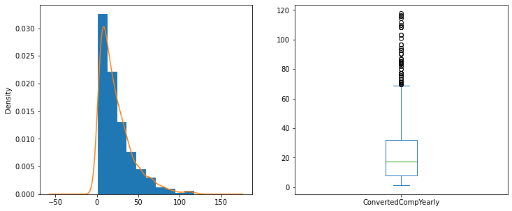
    


Подбираем распределения и оцениваем их


```python
def selection(data):
    for function in [[scipy.stats.norm, 'norm'], [scipy.stats.genlogistic, 'genlogistic'], [scipy.stats.triang, 'triang'], [scipy.stats.expon, 'expon'], [scipy.stats.gumbel_r, 'gumbel_r'], [scipy.stats.alpha, 'alpha'], [scipy.stats.halfnorm, 'halfnorm'], [scipy.stats.exponnorm, 'exponnorm'], [scipy.stats.fisk, 'fisk'], [scipy.stats.genpareto, 'genpareto']]:
        args = function[0].fit(data)
        summa_a = 0
        summa_b = 0
        for i in list(data):
            p = function[0].pdf(i, *args)
            if p > 1:
                print(p)
            summa_a+=p
        
        for j in np.arange(.05, 1, .05):
            l = (function[0].ppf(j, *args) - data.quantile(j))**2
            summa_b+=l
        
        
        kstest = scipy.stats.kstest(data, cdf=function[1], args=args).pvalue
        cramervonmises = scipy.stats.cramervonmises(data, cdf=function[1], args=args).pvalue
        
        if kstest > .05 and cramervonmises > .05:
            print(f'Распределение {str(function[1])}:') 
            print(f'Параметры MLE оптимизации: {args}')
            print('Метод максимального правдоподобия - {:.3f}'.format(summa_a))
            print('Метод наименьших квадратов (квантиль) - {:.3f}'.format(summa_b/19))
            print('Критерий Колмогорова - {:.3f}'.format(kstest))
            print('Критерий Крамера - {:.3f}'.format(cramervonmises))
            print('______________________________________________')
        
        xdata = np.arange(.01, 1, .01)
        ydata = np.array(data.quantile(xdata))
        popt, pcov = scipy.optimize.curve_fit(function[0].ppf, xdata, ydata, args)
        arg = tuple(popt)
            
        summa_a = 0
        summa_b = 0
        
        for i in list(data):
            p = function[0].pdf(i, *popt)
            if p > 1:
                print(p)
            summa_a+=p
        
        for j in np.arange(.05, 1, .05):
            l = (function[0].ppf(j, *popt) - data.quantile(j))**2
            summa_b+=l
              
        kstest = scipy.stats.kstest(data, cdf=function[1], args=arg).pvalue
        cramervonmises = scipy.stats.cramervonmises(data, cdf=function[1], args=arg).pvalue
        
        if kstest > .05 and cramervonmises > .05:
            print(f'Распределение {str(function[1])}:') 
            print(f'Параметры МНК оптимизации: {arg}')
            print('Метод максимального правдоподобия - {:.3f}'.format(summa_a))
            print('Метод наименьших квадратов (квантиль) - {:.3f}'.format(summa_b/19))
            print('Критерий Колмогорова - {:.3f}'.format(kstest))
            print('Критерий Крамера - {:.3f}'.format(cramervonmises))
            print('______________________________________________')
```


```python
selection(India)
```

    /Users/danilshulgan/opt/anaconda3/lib/python3.9/site-packages/scipy/stats/_distn_infrastructure.py:2781: RuntimeWarning: invalid value encountered in double_scalars
      Lhat = muhat - Shat*mu


    Распределение exponnorm:
    Параметры MLE оптимизации: (30.61173160685778, 1.8672246150198575, 0.7023516304033273)
    Метод максимального правдоподобия - 37.101
    Метод наименьших квадратов (квантиль) - 0.541
    Критерий Колмогорова - 0.055
    Критерий Крамера - 0.360
    ______________________________________________
    Распределение genpareto:
    Параметры МНК оптимизации: (-0.05348513403323241, 1.6798573398310341, 22.911841093904656)
    Метод максимального правдоподобия - 36.715
    Метод наименьших квадратов (квантиль) - 0.273
    Критерий Колмогорова - 0.362
    Критерий Крамера - 0.606
    ______________________________________________


```python
selection(France)
```

    Распределение exponnorm:
    Параметры MLE оптимизации: (1.8814567549663108, 33.76343532694466, 10.766057532381236)
    Метод максимального правдоподобия - 14.606
    Метод наименьших квадратов (квантиль) - 0.761
    Критерий Колмогорова - 0.094
    Критерий Крамера - 0.329
    ______________________________________________
    Распределение fisk:
    Параметры MLE оптимизации: (4.989293615202742, -6.835620262141303, 56.80426845335977)
    Метод максимального правдоподобия - 14.712
    Метод наименьших квадратов (квантиль) - 0.964
    Критерий Колмогорова - 0.068
    Критерий Крамера - 0.363
    ______________________________________________
    Распределение fisk:
    Параметры МНК оптимизации: (4.758516058558682, -4.67120216240565, 54.65002874430352)
    Метод максимального правдоподобия - 14.666
    Метод наименьших квадратов (квантиль) - 0.826
    Критерий Колмогорова - 0.070
    Критерий Крамера - 0.357
    ______________________________________________


```python
selection(Russia)
```

    Распределение genlogistic:
    Параметры MLE оптимизации: (579.9129767044037, -99.0816011407943, 20.636835201228166)
    Метод максимального правдоподобия - 4.467
    Метод наименьших квадратов (квантиль) - 4.471
    Критерий Колмогорова - 0.193
    Критерий Крамера - 0.317
    ______________________________________________
    Распределение genlogistic:
    Параметры МНК оптимизации: (731.932097988391, -106.59888101232107, 21.051131589018073)
    Метод максимального правдоподобия - 4.425
    Метод наименьших квадратов (квантиль) - 3.364
    Критерий Колмогорова - 0.247
    Критерий Крамера - 0.374
    ______________________________________________
    Распределение triang:
    Параметры МНК оптимизации: (0.12465609596120131, 0.6232199288420176, 116.11398311028996)
    Метод максимального правдоподобия - 4.337
    Метод наименьших квадратов (квантиль) - 2.125
    Критерий Колмогорова - 0.164
    Критерий Крамера - 0.368
    ______________________________________________
    Распределение gumbel_r:
    Параметры MLE оптимизации: (32.18977987612076, 20.63798840599493)
    Метод максимального правдоподобия - 4.469
    Метод наименьших квадратов (квантиль) - 4.520
    Критерий Колмогорова - 0.188
    Критерий Крамера - 0.319
    ______________________________________________
    Распределение gumbel_r:
    Параметры МНК оптимизации: (32.22869793968276, 21.060168726574254)
    Метод максимального правдоподобия - 4.426
    Метод наименьших квадратов (квантиль) - 3.364
    Критерий Колмогорова - 0.249
    Критерий Крамера - 0.375
    ______________________________________________
    Распределение alpha:
    Параметры МНК оптимизации: (6.709249032933653, -124.05691751365416, 1103.7345313567955)
    Метод максимального правдоподобия - 4.369
    Метод наименьших квадратов (квантиль) - 3.544
    Критерий Колмогорова - 0.122
    Критерий Крамера - 0.292
    ______________________________________________
    Распределение halfnorm:
    Параметры МНК оптимизации: (9.348438933838752, 43.88734445316794)
    Метод максимального правдоподобия - 4.501
    Метод наименьших квадратов (квантиль) - 1.786
    Критерий Колмогорова - 0.312
    Критерий Крамера - 0.543
    ______________________________________________
    Распределение exponnorm:
    Параметры MLE оптимизации: (2.7299739683909063, 16.727256105979837, 10.136277604772731)
    Метод максимального правдоподобия - 4.542
    Метод наименьших квадратов (квантиль) - 8.249
    Критерий Колмогорова - 0.144
    Критерий Крамера - 0.297
    ______________________________________________
    Распределение exponnorm:
    Параметры МНК оптимизации: (1.4725584384884407, 21.925055111082685, 15.239966418945105)
    Метод максимального правдоподобия - 4.392
    Метод наименьших квадратов (квантиль) - 5.359
    Критерий Колмогорова - 0.126
    Критерий Крамера - 0.160
    ______________________________________________
    Распределение fisk:
    Параметры MLE оптимизации: (3.4785070684569055, -11.013834411025382, 49.78220796075918)
    Метод максимального правдоподобия - 4.498
    Метод наименьших квадратов (квантиль) - 10.927
    Критерий Колмогорова - 0.174
    Критерий Крамера - 0.339
    ______________________________________________
    Распределение genpareto:
    Параметры МНК оптимизации: (-0.34119339198250365, 10.460592525531057, 45.35020620360742)
    Метод максимального правдоподобия - 4.443
    Метод наименьших квадратов (квантиль) - 2.031
    Критерий Колмогорова - 0.069
    Критерий Крамера - 0.377
    ______________________________________________


```python
selection(Canada)
```

    Распределение alpha:
    Параметры MLE оптимизации: (4.23727435410207, -66.50385756541556, 662.4946184599764)
    Метод максимального правдоподобия - 8.711
    Метод наименьших квадратов (квантиль) - 4.478
    Критерий Колмогорова - 0.124
    Критерий Крамера - 0.376
    ______________________________________________
    Распределение alpha:
    Параметры МНК оптимизации: (4.031487551775897, -57.34479170025379, 591.7815146574387)
    Метод максимального правдоподобия - 8.788
    Метод наименьших квадратов (квантиль) - 3.192
    Критерий Колмогорова - 0.140
    Критерий Крамера - 0.447
    ______________________________________________
    Распределение exponnorm:
    Параметры MLE оптимизации: (3.0268946802988226, 55.34970300949473, 14.907512060271312)
    Метод максимального правдоподобия - 8.757
    Метод наименьших квадратов (квантиль) - 4.186
    Критерий Колмогорова - 0.166
    Критерий Крамера - 0.488
    ______________________________________________
    Распределение exponnorm:
    Параметры МНК оптимизации: (3.3915632642323734, 54.274978522168425, 13.561330651411271)
    Метод максимального правдоподобия - 8.816
    Метод наименьших квадратов (квантиль) - 4.161
    Критерий Колмогорова - 0.090
    Критерий Крамера - 0.388
    ______________________________________________
    Распределение fisk:
    Параметры MLE оптимизации: (3.468603803639062, 13.142304259737017, 76.42789233402956)
    Метод максимального правдоподобия - 8.776
    Метод наименьших квадратов (квантиль) - 3.125
    Критерий Колмогорова - 0.059
    Критерий Крамера - 0.331
    ______________________________________________


```python
India_genpareto_args = (-0.05348513403323241, 1.6798573398310341, 22.911841093904656)
fig, ax = plt.subplots(1, 2, figsize=(12, 5))  
India.plot.hist(density=True, ax=ax[0], bins=12) 
ax[0].plot(np.linspace(0, 140), scipy.stats.genpareto.pdf(np.linspace(0, 140), *India_genpareto_args))
scipy.stats.probplot(India, dist=scipy.stats.genpareto(*India_genpareto_args), plot=ax[1])
```


    ((array([  1.68934426,   1.70289146,   1.71659226, ..., 126.44531149,
             133.92646054, 147.64398891]),
      array([  1.08 ,   1.08 ,   1.161, ..., 116.076, 116.256, 117.624])),
     (0.9914930564498434, 0.15425129805788984, 0.9985827215323481))


    
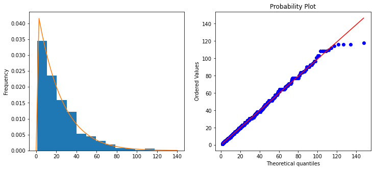
    


```python
France_exponnorm_args = (1.8814567549663108, 33.76343532694466, 10.766057532381236)
fig, ax = plt.subplots(1, 2, figsize=(12, 5))  
France.plot.hist(density=True, ax=ax[0], bins=12) 
ax[0].plot(np.linspace(0, 175), scipy.stats.exponnorm.pdf(np.linspace(0, 175), *France_exponnorm_args))
scipy.stats.probplot(France, dist=scipy.stats.exponnorm(*France_exponnorm_args), plot=ax[1])
```


    ((array([  5.97357876,   9.14863206,  10.93636716,  12.20491119,
              13.1993366 ,  14.02275893,  14.72871679,  15.34871819,
              15.90293349,  16.40508316,  16.86493938,  17.28971798,
              17.68490448,  18.0547702 ,  18.40270855,  18.73146201,
              19.04327984,  19.34003065,  19.62328434,  19.89437312,
              20.15443758,  20.40446207,  20.64530223,  20.87770672,
              21.10233449,  21.31976869,  21.53052798,  21.7350758 ,
              21.93382799,  22.1271592 ,  22.31540815,  22.4988822 ,
              22.67786108,  22.85260018,  23.02333329,  23.19027504,
              23.35362292,  23.51355908,  23.67025194,  23.82385748,
              23.9745205 ,  24.12237568,  24.26754848,  24.41015598,
              24.55030763,  24.6881059 ,  24.82364689,  24.9570208 ,
              25.08831246,  25.21760174,  25.34496392,  25.47047004,
              25.59418724,  25.71617903,  25.83650554,  25.95522376,
              26.07238777,  26.18804895,  26.30225612,  26.41505573,
              26.52649204,  26.63660719,  26.74544142,  26.8530331 ,
              26.95941891,  27.06463391,  27.16871164,  27.2716842 ,
              27.37358236,  27.47443558,  27.57427215,  27.6731192 ,
              27.7710028 ,  27.86794799,  27.96397884,  28.05911851,
              28.15338927,  28.2468126 ,  28.33940917,  28.43119889,
              28.522201  ,  28.61243402,  28.70191584,  28.79066376,
              28.87869446,  28.96602406,  29.05266817,  29.13864188,
              29.22395977,  29.30863598,  29.3926842 ,  29.47611766,
              29.55894923,  29.64119135,  29.72285609,  29.80395516,
              29.88449993,  29.96450144,  30.04397038,  30.12291718,
              30.20135193,  30.27928445,  30.3567243 ,  30.43368077,
              30.51016289,  30.58617944,  30.66173899,  30.73684985,
              30.81152013,  30.88575775,  30.95957037,  31.03296552,
              31.10595048,  31.1785324 ,  31.2507182 ,  31.32251469,
              31.39392845,  31.46496595,  31.53563348,  31.6059372 ,
              31.67588309,  31.74547704,  31.81472476,  31.88363184,
              31.95220377,  32.02044588,  32.0883634 ,  32.15596144,
              32.22324499,  32.29021895,  32.3568881 ,  32.42325711,
              32.48933058,  32.55511297,  32.62060869,  32.68582202,
              32.75075719,  32.8154183 ,  32.87980941,  32.94393447,
              33.00779736,  33.07140189,  33.13475177,  33.19785066,
              33.26070216,  33.32330976,  33.38567693,  33.44780703,
              33.5097034 ,  33.57136929,  33.63280788,  33.69402233,
              33.75501571,  33.81579104,  33.87635129,  33.93669938,
              33.99683817,  34.05677048,  34.11649907,  34.17602666,
              34.23535592,  34.29448947,  34.35342989,  34.41217971,
              34.47074143,  34.52911751,  34.58731034,  34.6453223 ,
              34.70315573,  34.76081291,  34.81829611,  34.87560755,
              34.93274941,  34.98972384,  35.04653297,  35.10317887,
              35.1596636 ,  35.21598917,  35.27215759,  35.3281708 ,
              35.38403075,  35.43973932,  35.4952984 ,  35.55070982,
              35.60597541,  35.66109696,  35.71607624,  35.77091497,
              35.82561489,  35.88017767,  35.934605  ,  35.9888985 ,
              36.04305981,  36.09709052,  36.1509922 ,  36.20476642,
              36.2584147 ,  36.31193856,  36.36533949,  36.41861896,
              36.47177843,  36.52481934,  36.57774309,  36.63055109,
              36.68324471,  36.73582532,  36.78829425,  36.84065285,
              36.89290241,  36.94504423,  36.9970796 ,  37.04900976,
              37.10083598,  37.15255948,  37.20418147,  37.25570317,
              37.30712575,  37.3584504 ,  37.40967827,  37.46081051,
              37.51184825,  37.56279262,  37.61364471,  37.66440563,
              37.71507646,  37.76565826,  37.8161521 ,  37.86655903,
              37.91688006,  37.96711624,  38.01726858,  38.06733806,
              38.11732569,  38.16723245,  38.21705931,  38.26680722,
              38.31647713,  38.36606999,  38.41558673,  38.46502826,
              38.5143955 ,  38.56368934,  38.61291069,  38.66206043,
              38.71113943,  38.76014856,  38.80908868,  38.85796063,
              38.90676527,  38.95550342,  39.0041759 ,  39.05278355,
              39.10132717,  39.14980755,  39.19822551,  39.24658182,
              39.29487727,  39.34311264,  39.39128868,  39.43940616,
              39.48746584,  39.53546846,  39.58341476,  39.63130548,
              39.67914135,  39.72692308,  39.7746514 ,  39.82232701,
              39.86995061,  39.91752292,  39.96504461,  40.01251638,
              40.05993891,  40.10731287,  40.15463894,  40.20191778,
              40.24915005,  40.2963364 ,  40.3434775 ,  40.39057397,
              40.43762647,  40.48463563,  40.53160208,  40.57852645,
              40.62540935,  40.67225141,  40.71905325,  40.76581546,
              40.81253865,  40.85922343,  40.90587038,  40.95248011,
              40.99905321,  41.04559024,  41.0920918 ,  41.13855846,
              41.1849908 ,  41.23138938,  41.27775478,  41.32408754,
              41.37038823,  41.41665741,  41.46289563,  41.50910343,
              41.55528137,  41.60142997,  41.64754979,  41.69364135,
              41.73970519,  41.78574184,  41.83175183,  41.87773567,
              41.92369389,  41.96962701,  42.01553555,  42.06142   ,
              42.10728089,  42.15311872,  42.198934  ,  42.24472722,
              42.29049889,  42.3362495 ,  42.38197954,  42.42768952,
              42.47337992,  42.51905122,  42.56470391,  42.61033848,
              42.6559554 ,  42.70155516,  42.74713822,  42.79270507,
              42.83825617,  42.883792  ,  42.92931303,  42.97481971,
              43.02031253,  43.06579193,  43.11125838,  43.15671233,
              43.20215426,  43.2475846 ,  43.29300382,  43.33841237,
              43.38381069,  43.42919924,  43.47457847,  43.51994882,
              43.56531073,  43.61066465,  43.65601102,  43.70135029,
              43.74668288,  43.79200923,  43.83732979,  43.88264499,
              43.92795526,  43.97326103,  44.01856274,  44.06386082,
              44.10915569,  44.15444778,  44.19973752,  44.24502534,
              44.29031166,  44.3355969 ,  44.38088148,  44.42616584,
              44.47145039,  44.51673554,  44.56202173,  44.60730936,
              44.65259886,  44.69789064,  44.74318512,  44.78848271,
              44.83378383,  44.87908889,  44.9243983 ,  44.96971248,
              45.01503185,  45.0603568 ,  45.10568775,  45.15102512,
              45.19636931,  45.24172073,  45.28707978,  45.33244689,
              45.37782246,  45.42320688,  45.46860058,  45.51400396,
              45.55941741,  45.60484136,  45.65027621,  45.69572236,
              45.74118021,  45.78665018,  45.83213266,  45.87762806,
              45.9231368 ,  45.96865926,  46.01419585,  46.05974699,
              46.10531307,  46.1508945 ,  46.19649167,  46.24210501,
              46.2877349 ,  46.33338176,  46.37904598,  46.42472798,
              46.47042816,  46.51614691,  46.56188465,  46.60764178,
              46.65341871,  46.69921583,  46.74503356,  46.79087231,
              46.83673246,  46.88261445,  46.92851866,  46.97444551,
              47.0203954 ,  47.06636874,  47.11236594,  47.15838741,
              47.20443356,  47.25050478,  47.29660151,  47.34272413,
              47.38887307,  47.43504874,  47.48125155,  47.5274819 ,
              47.57374022,  47.62002691,  47.6663424 ,  47.71268709,
              47.7590614 ,  47.80546574,  47.85190054,  47.89836621,
              47.94486316,  47.99139183,  48.03795262,  48.08454596,
              48.13117227,  48.17783197,  48.22452549,  48.27125325,
              48.31801567,  48.36481318,  48.4116462 ,  48.45851517,
              48.50542052,  48.55236267,  48.59934205,  48.64635911,
              48.69341426,  48.74050794,  48.7876406 ,  48.83481266,
              48.88202456,  48.92927674,  48.97656965,  49.02390373,
              49.0712794 ,  49.11869713,  49.16615736,  49.21366052,
              49.26120708,  49.30879748,  49.35643216,  49.40411159,
              49.45183621,  49.49960648,  49.54742286,  49.59528581,
              49.64319577,  49.69115323,  49.73915863,  49.78721244,
              49.83531513,  49.88346716,  49.93166901,  49.97992115,
              50.02822404,  50.07657817,  50.124984  ,  50.17344202,
              50.22195271,  50.27051654,  50.319134  ,  50.36780559,
              50.41653177,  50.46531305,  50.51414991,  50.56304285,
              50.61199236,  50.66099895,  50.7100631 ,  50.75918532,
              50.80836612,  50.85760599,  50.90690546,  50.95626502,
              51.0056852 ,  51.0551665 ,  51.10470944,  51.15431455,
              51.20398234,  51.25371333,  51.30350807,  51.35336706,
              51.40329085,  51.45327997,  51.50333495,  51.55345634,
              51.60364467,  51.65390049,  51.70422435,  51.7546168 ,
              51.80507838,  51.85560966,  51.9062112 ,  51.95688354,
              52.00762726,  52.05844292,  52.1093311 ,  52.16029236,
              52.21132728,  52.26243643,  52.31362041,  52.36487979,
              52.41621516,  52.46762711,  52.51911624,  52.57068314,
              52.62232842,  52.67405267,  52.72585651,  52.77774054,
              52.82970538,  52.88175164,  52.93387996,  52.98609094,
              53.03838522,  53.09076344,  53.14322622,  53.1957742 ,
              53.24840803,  53.30112836,  53.35393583,  53.40683109,
              53.45981481,  53.51288766,  53.56605028,  53.61930336,
              53.67264756,  53.72608357,  53.77961207,  53.83323375,
              53.88694929,  53.94075939,  53.99466475,  54.04866608,
              54.10276407,  54.15695946,  54.21125294,  54.26564525,
              54.32013711,  54.37472925,  54.42942242,  54.48421734,
              54.53911476,  54.59411544,  54.64922014,  54.7044296 ,
              54.75974461,  54.81516592,  54.87069431,  54.92633058,
              54.98207549,  55.03792985,  55.09389446,  55.14997011,
              55.20615761,  55.26245778,  55.31887143,  55.3753994 ,
              55.43204252,  55.48880161,  55.54567753,  55.60267112,
              55.65978324,  55.71701475,  55.77436652,  55.83183942,
              55.88943433,  55.94715214,  56.00499374,  56.06296002,
              56.12105191,  56.1792703 ,  56.23761612,  56.2960903 ,
              56.35469376,  56.41342746,  56.47229233,  56.53128933,
              56.59041942,  56.64968358,  56.70908277,  56.76861799,
              56.82829022,  56.88810047,  56.94804974,  57.00813905,
              57.06836942,  57.12874188,  57.18925747,  57.24991723,
              57.31072224,  57.37167353,  57.43277221,  57.49401933,
              57.555416  ,  57.6169633 ,  57.67866236,  57.74051428,
              57.8025202 ,  57.86468125,  57.92699856,  57.98947331,
              58.05210664,  58.11489974,  58.17785379,  58.24096998,
              58.30424952,  58.36769361,  58.43130348,  58.49508037,
              58.55902552,  58.62314019,  58.68742564,  58.75188316,
              58.81651402,  58.88131953,  58.946301  ,  59.01145975,
              59.07679712,  59.14231445,  59.2080131 ,  59.27389444,
              59.33995985,  59.40621074,  59.47264849,  59.53927454,
              59.60609032,  59.67309727,  59.74029686,  59.80769055,
              59.87527983,  59.94306621,  60.01105118,  60.07923629,
              60.14762308,  60.2162131 ,  60.28500791,  60.35400912,
              60.42321832,  60.49263712,  60.56226716,  60.63211009,
              60.70216756,  60.77244126,  60.84293289,  60.91364415,
              60.98457678,  61.05573251,  61.12711312,  61.19872038,
              61.2705561 ,  61.34262208,  61.41492016,  61.4874522 ,
              61.56022006,  61.63322564,  61.70647084,  61.7799576 ,
              61.85368786,  61.92766359,  62.00188678,  62.07635944,
              62.1510836 ,  62.22606131,  62.30129464,  62.3767857 ,
              62.45253658,  62.52854944,  62.60482644,  62.68136976,
              62.75818161,  62.83526422,  62.91261986,  62.99025079,
              63.06815932,  63.1463478 ,  63.22481857,  63.30357401,
              63.38261654,  63.46194859,  63.54157263,  63.62149114,
              63.70170665,  63.7822217 ,  63.86303886,  63.94416075,
              64.02559   ,  64.10732928,  64.18938127,  64.27174872,
              64.35443438,  64.43744103,  64.52077152,  64.60442869,
              64.68841543,  64.77273468,  64.8573894 ,  64.94238258,
              65.02771726,  65.1133965 ,  65.19942342,  65.28580115,
              65.3725329 ,  65.45962187,  65.54707133,  65.63488459,
              65.723065  ,  65.81161593,  65.90054082,  65.98984315,
              66.07952644,  66.16959424,  66.26005017,  66.35089788,
              66.44214108,  66.53378352,  66.625829  ,  66.71828138,
              66.81114455,  66.90442247,  66.99811915,  67.09223865,
              67.18678508,  67.28176262,  67.3771755 ,  67.47302801,
              67.56932449,  67.66606934,  67.76326704,  67.86092212,
              67.95903917,  68.05762285,  68.15667789,  68.25620908,
              68.35622128,  68.45671943,  68.55770852,  68.65919365,
              68.76117995,  68.86367266,  68.96667708,  69.07019859,
              69.17424267,  69.27881486,  69.38392078,  69.48956617,
              69.59575682,  69.70249863,  69.80979759,  69.91765978,
              70.02609136,  70.13509862,  70.24468792,  70.35486575,
              70.46563867,  70.57701338,  70.68899665,  70.80159541,
              70.91481666,  71.02866754,  71.14315529,  71.25828729,
              71.37407105,  71.49051417,  71.60762442,  71.72540968,
              71.84387797,  71.96303746,  72.08289644,  72.20346338,
              72.32474686,  72.44675564,  72.56949863,  72.6929849 ,
              72.81722368,  72.94222437,  73.06799656,  73.19454998,
              73.32189458,  73.45004048,  73.57899798,  73.70877759,
              73.83939002,  73.97084618,  74.1031572 ,  74.23633442,
              74.3703894 ,  74.50533393,  74.64118005,  74.77794003,
              74.91562637,  75.05425185,  75.19382951,  75.33437265,
              75.47589484,  75.61840995,  75.76193213,  75.90647584,
              76.05205585,  76.19868724,  76.34638541,  76.49516612,
              76.64504547,  76.7960399 ,  76.94816624,  77.10144169,
              77.25588385,  77.4115107 ,  77.56834067,  77.72639258,
              77.88568574,  78.04623986,  78.20807517,  78.37121236,
              78.53567263,  78.7014777 ,  78.86864982,  79.03721179,
              79.20718699,  79.37859941,  79.5514736 ,  79.7258348 ,
              79.90170886,  80.07912235,  80.2581025 ,  80.43867729,
              80.62087545,  80.8047265 ,  80.99026074,  81.17750934,
              81.36650433,  81.55727864,  81.74986613,  81.94430166,
              82.14062107,  82.33886127,  82.53906027,  82.74125718,
              82.94549235,  83.1518073 ,  83.36024487,  83.57084922,
              83.78366591,  83.99874195,  84.21612584,  84.43586769,
              84.65801923,  84.88263393,  85.10976705,  85.33947571,
              85.57181903,  85.80685817,  86.04465643,  86.28527939,
              86.52879498,  86.7752736 ,  87.02478827,  87.27741473,
              87.53323159,  87.79232049,  88.05476622,  88.32065691,
              88.59008424,  88.86314355,  89.13993411,  89.42055933,
              89.70512696,  89.99374935,  90.28654374,  90.58363251,
              90.88514352,  91.19121042,  91.501973  ,  91.81757762,
              92.13817754,  92.46393345,  92.7950139 ,  93.13159587,
              93.47386527,  93.82201763,  94.17625873,  94.53680534,
              94.903886  ,  95.27774193,  95.65862794,  96.0468135 ,
              96.44258388,  96.84624139,  97.2581068 ,  97.67852084,
              98.10784592,  98.54646798,  98.99479862,  99.45327735,
              99.92237426, 100.40259285, 100.89447331, 101.39859618,
             101.91558645, 102.44611823, 102.99092003, 103.55078077,
             104.12655667, 104.71917911, 105.3296637 , 105.95912075,
             106.60876744, 107.27994196, 107.97412012, 108.69293489,
             109.43819955, 110.21193524, 111.01640398, 111.85414858,
             112.7280411 , 113.64134227, 114.59777494, 115.60161575,
             116.65781076, 117.77212286, 118.95132216, 120.20343532,
             121.53807713, 122.96689927, 124.5042096 , 126.16784652,
             127.98044537, 129.97132929, 132.17943455, 134.65803397,
             137.48277292, 140.7662678 , 144.68697652, 149.55325292,
             155.97117746, 165.41990177, 183.38229783]),
      array([  3.009,  10.872,  12.36 ,  12.792,  12.792,  12.792,  12.792,
              12.792,  12.797,  13.572,  14.076,  14.076,  14.076,  15.36 ,
              16.068,  17.016,  17.916,  19.2  ,  19.2  ,  19.2  ,  19.2  ,
              19.2  ,  19.392,  19.836,  20.04 ,  20.22 ,  20.262,  20.472,
              20.472,  20.472,  21.744,  21.756,  21.756,  22.392,  22.392,
              22.392,  23.04 ,  23.04 ,  23.04 ,  23.04 ,  23.676,  23.995,
              24.312,  24.312,  24.528,  24.96 ,  25.594,  25.596,  25.596,
              25.596,  25.596,  25.596,  25.596,  25.596,  25.596,  25.596,
              25.596,  25.596,  26.04 ,  26.232,  26.616,  26.661,  26.688,
              26.772,  26.88 ,  26.88 ,  26.88 ,  26.88 ,  26.88 ,  27.194,
              27.264,  27.516,  27.516,  27.516,  27.648,  27.732,  27.768,
              28.152,  28.152,  28.152,  28.152,  28.152,  28.404,  28.476,
              28.788,  28.794,  29.436,  29.436,  29.436,  29.436,  29.436,
              29.436,  29.436,  29.436,  29.736,  29.82 ,  29.86 ,  30.072,
              30.393,  30.393,  30.708,  30.708,  30.708,  30.708,  30.708,
              30.713,  30.82 ,  31.356,  31.356,  31.356,  31.992,  31.992,
              31.992,  31.992,  31.992,  31.992,  31.992,  31.992,  31.992,
              31.992,  31.992,  31.992,  31.992,  31.992,  31.992,  31.993,
              31.993,  31.993,  31.993,  31.993,  31.993,  31.993,  33.06 ,
              33.26 ,  33.273,  33.276,  33.276,  33.276,  33.276,  33.276,
              33.48 ,  33.603,  34.126,  34.126,  34.126,  34.126,  34.126,
              34.126,  34.126,  34.126,  34.126,  34.126,  34.126,  34.126,
              34.128,  34.393,  34.548,  34.548,  34.548,  34.548,  34.548,
              34.548,  34.548,  34.979,  35.192,  35.192,  35.192,  35.192,
              35.192,  35.192,  35.192,  35.192,  35.192,  35.196,  35.196,
              35.299,  35.619,  35.726,  35.832,  35.832,  36.259,  36.259,
              36.259,  36.259,  36.259,  36.259,  36.259,  36.259,  36.468,
              36.792,  36.792,  36.899,  36.952,  36.984,  37.005,  37.116,
              37.325,  37.325,  37.325,  37.325,  37.325,  37.325,  37.325,
              37.325,  37.325,  37.325,  37.325,  37.859,  37.859,  37.859,
              38.388,  38.388,  38.388,  38.388,  38.388,  38.388,  38.388,
              38.388,  38.388,  38.388,  38.388,  38.388,  38.392,  38.392,
              38.392,  38.392,  38.392,  38.392,  38.392,  38.392,  38.392,
              38.392,  38.392,  38.392,  38.392,  38.392,  38.392,  38.392,
              38.392,  38.392,  38.392,  38.658,  38.925,  39.096,  39.458,
              39.458,  39.458,  39.458,  39.458,  39.458,  39.54 ,  39.671,
              39.672,  39.842,  39.991,  39.991,  40.098,  40.525,  40.525,
              40.525,  40.525,  40.525,  40.525,  40.525,  40.525,  40.525,
              40.525,  40.525,  40.525,  40.525,  40.525,  40.525,  40.525,
              40.956,  40.956,  40.956,  40.956,  41.017,  41.058,  41.591,
              41.591,  41.591,  41.591,  41.591,  41.591,  41.591,  42.018,
              42.124,  42.228,  42.231,  42.648,  42.657,  42.657,  42.657,
              42.657,  42.657,  42.657,  42.657,  42.657,  42.657,  42.657,
              42.657,  42.657,  42.657,  42.657,  42.657,  42.657,  42.657,
              42.657,  42.657,  42.657,  42.657,  42.657,  42.657,  42.657,
              42.657,  42.657,  42.657,  42.657,  42.657,  42.657,  42.657,
              42.657,  42.657,  42.657,  42.657,  42.657,  42.657,  42.657,
              42.657,  42.657,  42.657,  42.657,  42.657,  42.657,  42.657,
              42.657,  42.876,  43.191,  43.512,  43.512,  43.512,  43.724,
              43.724,  43.724,  43.724,  43.724,  43.724,  43.724,  43.724,
              44.148,  44.257,  44.79 ,  44.79 ,  44.79 ,  44.79 ,  44.79 ,
              44.79 ,  44.79 ,  44.79 ,  44.79 ,  44.79 ,  44.79 ,  44.79 ,
              44.79 ,  44.79 ,  44.79 ,  44.79 ,  44.79 ,  44.79 ,  44.79 ,
              44.79 ,  44.79 ,  44.79 ,  44.79 ,  44.79 ,  44.79 ,  44.79 ,
              44.79 ,  44.79 ,  44.79 ,  44.79 ,  44.79 ,  44.79 ,  44.79 ,
              44.79 ,  44.796,  44.796,  44.796,  44.796,  44.796,  44.796,
              44.892,  45.324,  45.43 ,  45.432,  45.857,  45.857,  45.857,
              45.857,  45.857,  45.857,  45.857,  45.857,  45.857,  45.857,
              45.857,  45.857,  45.857,  45.857,  45.857,  45.857,  45.857,
              45.857,  45.857,  46.068,  46.068,  46.71 ,  46.923,  46.923,
              46.923,  46.923,  46.923,  46.923,  46.923,  46.923,  46.923,
              46.923,  46.923,  46.923,  46.923,  46.923,  46.923,  46.923,
              46.923,  46.923,  47.352,  47.456,  47.456,  47.99 ,  47.99 ,
              47.99 ,  47.99 ,  47.99 ,  47.99 ,  47.99 ,  47.99 ,  47.99 ,
              47.99 ,  47.99 ,  47.99 ,  47.99 ,  47.99 ,  47.99 ,  47.99 ,
              47.99 ,  47.99 ,  47.99 ,  47.99 ,  47.99 ,  47.99 ,  47.99 ,
              47.99 ,  47.99 ,  47.99 ,  47.99 ,  47.99 ,  47.99 ,  47.99 ,
              47.99 ,  47.99 ,  47.99 ,  47.99 ,  47.99 ,  47.99 ,  47.99 ,
              47.99 ,  47.99 ,  47.99 ,  47.99 ,  47.99 ,  47.99 ,  47.99 ,
              48.624,  48.624,  48.624,  48.624,  48.624,  48.843,  49.056,
              49.056,  49.056,  49.056,  49.056,  49.056,  49.056,  49.056,
              49.056,  49.056,  49.056,  49.056,  49.908,  50.123,  50.123,
              50.123,  50.123,  50.123,  50.123,  50.123,  51.189,  51.189,
              51.189,  51.189,  51.189,  51.189,  51.189,  51.189,  51.189,
              51.189,  51.189,  51.189,  51.189,  51.189,  51.189,  51.189,
              51.189,  51.192,  51.192,  51.192,  51.192,  51.192,  51.192,
              51.192,  51.192,  51.192,  51.192,  51.722,  51.722,  52.255,
              52.255,  52.255,  52.255,  52.464,  52.74 ,  52.789,  52.789,
              53.322,  53.322,  53.322,  53.322,  53.322,  53.322,  53.322,
              53.322,  53.322,  53.322,  53.322,  53.322,  53.322,  53.322,
              53.322,  53.322,  53.322,  53.322,  53.322,  53.322,  53.322,
              53.322,  53.322,  53.322,  53.322,  53.322,  53.322,  53.322,
              53.322,  53.322,  53.322,  53.322,  53.322,  53.322,  53.322,
              53.322,  53.322,  53.322,  53.322,  53.322,  53.322,  53.322,
              54.384,  54.388,  54.388,  54.388,  54.388,  54.388,  54.388,
              54.762,  55.028,  55.241,  55.266,  55.455,  55.455,  55.455,
              55.455,  55.455,  55.455,  55.455,  55.455,  55.455,  55.455,
              55.455,  55.455,  55.455,  55.455,  55.455,  55.455,  55.455,
              55.455,  55.455,  55.988,  56.521,  56.521,  56.521,  56.521,
              56.521,  56.521,  56.521,  56.521,  56.521,  57.588,  57.588,
              57.588,  57.588,  57.588,  57.588,  57.588,  57.588,  57.588,
              57.588,  57.588,  57.588,  57.588,  57.588,  57.588,  57.588,
              57.588,  58.65 ,  58.654,  58.654,  58.654,  58.654,  58.654,
              58.654,  58.654,  58.654,  58.654,  58.654,  58.654,  58.654,
              58.654,  58.654,  58.654,  58.654,  58.654,  58.654,  58.654,
              58.654,  58.654,  58.654,  58.654,  58.654,  58.654,  58.654,
              58.654,  58.654,  58.654,  58.654,  58.654,  59.187,  59.507,
              59.72 ,  59.72 ,  59.72 ,  59.72 ,  59.72 ,  59.72 ,  59.72 ,
              60.787,  60.787,  60.787,  60.787,  60.787,  60.787,  60.787,
              60.787,  61.32 ,  61.32 ,  61.428,  61.853,  61.853,  61.853,
              61.853,  61.853,  61.853,  61.853,  62.052,  62.093,  62.712,
              62.92 ,  62.92 ,  63.984,  63.984,  63.984,  63.984,  63.986,
              63.986,  63.986,  63.986,  63.986,  63.986,  63.986,  63.986,
              63.986,  63.986,  63.986,  63.986,  63.986,  63.986,  63.986,
              63.986,  63.986,  63.986,  63.986,  63.986,  63.986,  63.986,
              63.986,  63.986,  63.986,  63.986,  63.986,  63.986,  63.986,
              63.986,  63.986,  63.986,  63.986,  63.986,  63.986,  65.053,
              65.053,  65.053,  65.053,  66.119,  66.119,  66.119,  66.119,
              66.119,  66.119,  66.119,  66.119,  66.132,  67.186,  67.186,
              67.186,  67.186,  67.186,  67.186,  68.252,  68.252,  68.252,
              68.252,  68.252,  68.785,  69.144,  69.318,  69.318,  69.318,
              69.318,  69.318,  69.318,  69.318,  69.318,  69.318,  69.318,
              69.318,  69.318,  69.318,  69.318,  69.318,  69.318,  69.318,
              69.318,  69.318,  69.318,  69.318,  69.852,  70.38 ,  70.38 ,
              70.385,  70.385,  71.451,  71.451,  72.518,  72.518,  72.518,
              73.584,  73.883,  73.989,  74.608,  74.651,  74.651,  74.651,
              74.651,  74.651,  74.651,  74.651,  74.651,  74.651,  74.651,
              74.651,  74.651,  74.651,  74.651,  74.651,  74.651,  74.651,
              74.651,  74.651,  74.651,  74.651,  74.651,  74.651,  74.651,
              74.651,  75.717,  75.717,  76.25 ,  76.783,  76.783,  76.783,
              76.783,  76.783,  76.783,  76.783,  76.783,  76.783,  76.783,
              76.788,  76.788,  76.788,  77.85 ,  77.85 ,  78.916,  79.983,
              79.983,  79.983,  79.983,  79.983,  79.983,  79.983,  79.983,
              79.983,  79.983,  79.983,  79.983,  79.983,  80.664,  81.049,
              81.049,  81.049,  82.116,  83.182,  83.182,  83.502,  85.132,
              85.315,  85.315,  85.315,  85.315,  85.315,  85.315,  85.315,
              85.315,  85.315,  85.315,  85.315,  85.315,  85.315,  87.024,
              87.448,  87.448,  87.907,  87.981,  88.13 ,  88.514,  89.58 ,
              89.581,  90.647,  90.647,  90.647,  90.647,  90.647,  90.647,
              90.647,  90.647,  90.647,  90.647,  90.647,  92.136,  92.14 ,
              93.078,  93.078,  95.976,  95.976,  95.979,  95.979,  95.979,
              95.979,  95.979,  95.979,  95.979,  95.979,  95.979,  95.979,
              95.979,  95.979,  95.979,  95.979,  95.979,  98.112,  99.179,
             101.312, 101.312, 101.312, 101.312, 103.419, 106.644, 106.644,
             106.644, 106.644, 106.644, 106.644, 106.644, 106.644, 106.644,
             106.644, 111.976, 115.176, 117.308, 117.308, 117.308, 120.   ,
             127.972, 127.972, 127.972, 127.972, 127.972, 127.972, 127.972,
             128.587, 138.637, 138.637, 141.685, 149.301, 159.966, 159.966,
             159.966, 168.54 , 170.63 , 180.   , 191.959])),
     (1.0322413104612522, -1.7152536652425496, 0.9969345498299685))


    
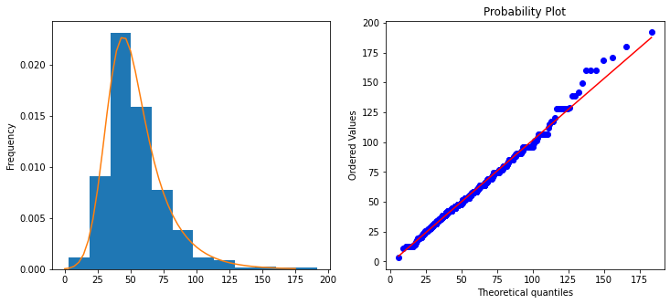
    


```python
Russia_halfnorm_args = (9.348438933838752, 43.88734445316794)
fig, ax = plt.subplots(1, 2, figsize=(12, 5))  
Russia.plot.hist(density=True, ax=ax[0], bins=12) 
ax[0].plot(np.linspace(0, 150), scipy.stats.halfnorm.pdf(np.linspace(0, 150), *Russia_halfnorm_args))
scipy.stats.probplot(Russia, dist=scipy.stats.halfnorm(*Russia_halfnorm_args), plot=ax[1])
```


    ((array([  9.44947689,   9.59368099,   9.73944464,   9.88521261,
              10.03098649,  10.17676791,  10.32255846,  10.46835977,
              10.61417344,  10.76000108,  10.90584431,  11.05170473,
              11.19758398,  11.34348366,  11.48940539,  11.63535079,
              11.78132149,  11.9273191 ,  12.07334526,  12.2194016 ,
              12.36548974,  12.51161131,  12.65776796,  12.80396132,
              12.95019304,  13.09646475,  13.24277811,  13.38913477,
              13.53553637,  13.68198459,  13.82848107,  13.97502749,
              14.12162552,  14.26827682,  14.41498308,  14.56174597,
              14.70856719,  14.85544842,  15.00239136,  15.14939771,
              15.29646918,  15.44360747,  15.59081431,  15.73809141,
              15.8854405 ,  16.03286332,  16.1803616 ,  16.32793709,
              16.47559154,  16.62332671,  16.77114436,  16.91904626,
              17.0670342 ,  17.21510995,  17.3632753 ,  17.51153207,
              17.65988204,  17.80832705,  17.95686891,  18.10550944,
              18.2542505 ,  18.40309392,  18.55204156,  18.70109529,
              18.85025698,  18.99952851,  19.14891177,  19.29840866,
              19.4480211 ,  19.597751  ,  19.74760029,  19.89757092,
              20.04766483,  20.19788399,  20.34823037,  20.49870595,
              20.64931272,  20.80005269,  20.95092788,  21.10194032,
              21.25309205,  21.40438512,  21.5558216 ,  21.70740356,
              21.85913311,  22.01101233,  22.16304336,  22.31522832,
              22.46756936,  22.62006864,  22.77272833,  22.92555062,
              23.07853772,  23.23169184,  23.38501522,  23.53851011,
              23.69217878,  23.8460235 ,  24.00004658,  24.15425033,
              24.30863708,  24.46320918,  24.61796901,  24.77291895,
              24.92806139,  25.08339877,  25.23893352,  25.39466811,
              25.55060502,  25.70674674,  25.86309579,  26.01965473,
              26.1764261 ,  26.3334125 ,  26.49061652,  26.6480408 ,
              26.80568798,  26.96356074,  27.12166176,  27.27999378,
              27.43855953,  27.59736178,  27.75640332,  27.91568697,
              28.07521557,  28.23499199,  28.39501913,  28.5552999 ,
              28.71583727,  28.8766342 ,  29.0376937 ,  29.19901881,
              29.3606126 ,  29.52247814,  29.68461859,  29.84703707,
              30.0097368 ,  30.17272098,  30.33599286,  30.49955574,
              30.66341293,  30.82756778,  30.99202368,  31.15678407,
              31.32185239,  31.48723214,  31.65292686,  31.81894013,
              31.98527555,  32.15193677,  32.31892749,  32.48625144,
              32.6539124 ,  32.82191418,  32.99026064,  33.15895568,
              33.32800326,  33.49740737,  33.66717206,  33.83730141,
              34.00779955,  34.17867069,  34.34991905,  34.52154891,
              34.69356464,  34.8659706 ,  35.03877127,  35.21197112,
              35.38557473,  35.55958671,  35.73401174,  35.90885455,
              36.08411993,  36.25981273,  36.43593789,  36.61250038,
              36.78950525,  36.96695763,  37.14486268,  37.32322567,
              37.50205192,  37.68134683,  37.86111587,  38.04136459,
              38.22209861,  38.40332363,  38.58504543,  38.76726988,
              38.95000293,  39.13325061,  39.31701903,  39.50131441,
              39.68614305,  39.87151134,  40.05742576,  40.2438929 ,
              40.43091944,  40.61851217,  40.80667797,  40.99542384,
              41.18475687,  41.37468427,  41.56521337,  41.75635161,
              41.94810655,  42.14048585,  42.33349732,  42.52714889,
              42.72144861,  42.91640467,  43.11202539,  43.30831924,
              43.5052948 ,  43.70296085,  43.90132626,  44.10040008,
              44.30019153,  44.50070995,  44.70196489,  44.90396603,
              45.10672324,  45.31024657,  45.51454622,  45.71963261,
              45.92551634,  46.13220819,  46.33971916,  46.54806043,
              46.75724343,  46.96727975,  47.17818125,  47.38996   ,
              47.60262828,  47.81619866,  48.0306839 ,  48.24609705,
              48.46245142,  48.67976055,  48.89803831,  49.11729879,
              49.33755643,  49.55882592,  49.78112229,  50.00446086,
              50.22885729,  50.45432758,  50.68088806,  50.90855543,
              51.13734673,  51.3672794 ,  51.59837126,  51.83064053,
              52.06410585,  52.29878626,  52.53470127,  52.77187082,
              53.01031533,  53.2500557 ,  53.49111331,  53.73351009,
              53.97726846,  54.22241142,  54.46896253,  54.71694592,
              54.96638634,  55.21730918,  55.46974046,  55.72370687,
              55.97923582,  56.23635542,  56.49509453,  56.75548279,
              57.01755065,  57.28132939,  57.54685113,  57.81414892,
              58.08325674,  58.35420951,  58.62704318,  58.90179475,
              59.17850228,  59.45720499,  59.73794326,  60.02075871,
              60.30569421,  60.592794  ,  60.88210367,  61.17367028,
              61.4675424 ,  61.76377016,  62.06240535,  62.36350148,
              62.66711386,  62.97329967,  63.28211807,  63.59363029,
              63.90789971,  64.22499198,  64.54497512,  64.86791967,
              65.19389876,  65.52298829,  65.85526707,  66.19081693,
              66.52972293,  66.8720735 ,  67.21796066,  67.56748017,
              67.92073177,  68.27781943,  68.63885152,  69.00394116,
              69.37320643,  69.74677071,  70.12476299,  70.50731822,
              70.89457771,  71.28668951,  71.68380886,  72.0860987 ,
              72.49373015,  72.90688309,  73.3257468 ,  73.75052062,
              74.18141466,  74.61865064,  75.06246275,  75.51309863,
              75.97082041,  76.4359059 ,  76.9086499 ,  77.38936557,
              77.87838608,  78.3760663 ,  78.88278485,  79.39894618,
              79.92498309,  80.46135944,  81.00857326,  81.56716019,
              82.13769746,  82.72080833,  83.31716722,  83.92750548,
              84.55261812,  85.1933715 ,  85.85071223,  86.5256775 ,
              87.21940723,  87.93315821,  88.66832088,  89.42643919,
              90.20923439,  91.01863355,  91.85680423,  92.72619664,
              93.62959577,  94.57018598,  95.55163223,  96.57818316,
              97.65480362,  98.78734734,  99.98278546, 101.24951407,
             102.59777635, 104.04025483, 105.59292385, 107.2763136 ,
             109.11745122, 111.15296985, 113.43435154, 116.03735815,
             119.08047576, 122.76531074, 127.48079393, 134.15324263,
             146.07548548]),
      array([  1.248,   1.452,   3.12 ,   3.463,   4.08 ,   5.196,   6.   ,
               6.24 ,   6.444,   7.272,   7.272,   8.316,   8.316,   8.316,
               8.316,   8.52 ,   9.348,   9.348,   9.564,   9.564,  10.392,
              10.392,  10.392,  10.392,  10.392,  11.424,  12.   ,  12.468,
              12.468,  12.468,  12.468,  12.468,  12.468,  12.468,  14.4  ,
              14.544,  14.544,  14.544,  14.544,  14.544,  14.544,  15.588,
              15.588,  15.588,  15.588,  15.588,  15.6  ,  15.6  ,  16.62 ,
              16.62 ,  16.62 ,  16.62 ,  16.62 ,  17.664,  18.288,  18.708,
              18.708,  18.708,  18.708,  19.104,  19.116,  19.2  ,  19.561,
              20.781,  20.784,  20.784,  20.784,  20.784,  20.784,  20.784,
              20.784,  20.784,  20.784,  20.784,  20.784,  20.784,  20.784,
              20.784,  20.784,  20.784,  20.784,  21.408,  22.44 ,  22.86 ,
              22.86 ,  22.86 ,  22.86 ,  22.86 ,  22.86 ,  22.86 ,  23.412,
              24.   ,  24.204,  24.312,  24.312,  24.516,  24.936,  24.936,
              24.936,  24.936,  24.936,  24.936,  24.936,  24.936,  24.936,
              24.936,  24.96 ,  25.98 ,  25.98 ,  26.184,  27.012,  27.012,
              27.012,  28.056,  28.056,  28.66 ,  29.088,  29.088,  29.088,
              29.088,  29.088,  29.088,  29.088,  29.088,  29.088,  29.088,
              29.088,  29.58 ,  29.712,  30.   ,  30.3  ,  31.176,  31.176,
              31.176,  31.176,  31.176,  31.176,  31.176,  31.176,  31.176,
              31.176,  31.176,  31.176,  31.176,  31.176,  31.176,  31.176,
              31.176,  31.176,  31.584,  31.584,  31.8  ,  32.424,  32.559,
              33.252,  33.252,  33.252,  33.252,  33.252,  33.252,  33.456,
              33.6  ,  34.908,  35.328,  35.328,  35.328,  35.328,  35.328,
              35.328,  35.328,  35.328,  35.328,  36.366,  36.576,  37.404,
              37.404,  37.404,  37.404,  37.404,  37.404,  37.404,  37.404,
              37.404,  37.404,  37.404,  38.388,  39.48 ,  39.48 ,  39.48 ,
              39.48 ,  40.524,  40.696,  40.944,  40.956,  41.556,  41.556,
              41.556,  41.556,  41.556,  41.556,  41.556,  41.556,  41.556,
              41.556,  41.556,  41.556,  41.556,  41.556,  41.556,  41.556,
              41.556,  41.556,  41.556,  41.556,  41.556,  41.556,  41.556,
              41.556,  42.6  ,  42.6  ,  42.996,  43.02 ,  43.2  ,  43.293,
              43.644,  45.72 ,  45.72 ,  45.72 ,  45.72 ,  45.72 ,  45.72 ,
              45.72 ,  47.796,  47.796,  47.796,  47.796,  47.796,  47.796,
              47.796,  48.   ,  49.872,  50.   ,  51.948,  51.948,  51.948,
              51.948,  51.948,  51.948,  51.948,  51.948,  51.948,  51.948,
              51.948,  51.948,  51.948,  52.56 ,  52.572,  52.992,  54.036,
              54.036,  54.24 ,  55.068,  55.068,  56.112,  56.112,  57.144,
              57.147,  58.188,  58.188,  58.188,  59.22 ,  59.22 ,  59.745,
              60.   ,  60.   ,  60.   ,  60.264,  60.468,  62.34 ,  62.34 ,
              62.34 ,  62.34 ,  62.34 ,  62.34 ,  62.34 ,  62.34 ,  62.34 ,
              62.34 ,  62.34 ,  62.34 ,  62.34 ,  62.34 ,  62.34 ,  62.34 ,
              62.34 ,  62.34 ,  62.4  ,  64.416,  64.416,  65.806,  65.808,
              66.504,  66.504,  66.912,  68.076,  68.58 ,  68.58 ,  69.269,
              69.612,  70.656,  70.656,  71.688,  71.688,  71.694,  72.   ,
              72.528,  72.732,  72.732,  72.732,  72.732,  72.732,  72.732,
              72.732,  72.732,  72.732,  73.825,  74.808,  74.808,  75.   ,
              75.   ,  75.432,  76.884,  76.884,  77.196,  78.972,  80.526,
              81.048,  83.124,  83.124,  83.124,  83.124,  83.124,  83.124,
              83.124,  83.124,  83.124,  83.124,  83.124,  83.124,  84.168,
              84.456,  86.587,  87.276,  90.05 ,  92.472,  93.516,  93.516,
              93.516,  93.516,  93.516,  98.712,  99.12 , 102.372, 103.908,
             103.908, 103.908, 103.908, 103.908, 103.908, 108.06 , 114.3  ,
             116.494, 121.221, 138.539, 144.   , 144.   , 145.464])),
     (1.0206030471552971, -0.8287742545839052, 0.9969807458951079))


    
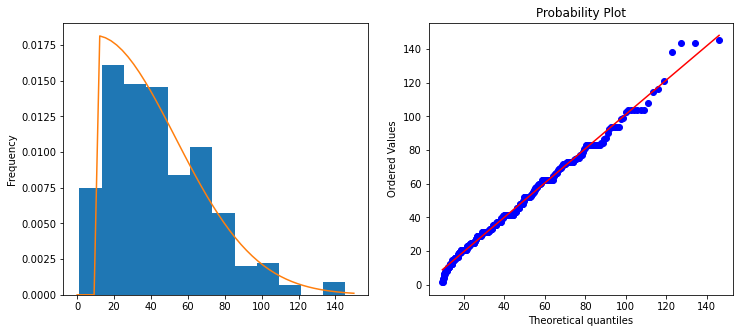
    


```python
Canada_alpha_args = (4.031487551775897, -57.34479170025379, 591.7815146574387)
fig, ax = plt.subplots(1, 2, figsize=(12, 5))  
Canada.plot.hist(density=True, ax=ax[0], bins=12) 
ax[0].plot(np.linspace(0, 350), scipy.stats.alpha.pdf(np.linspace(0, 350), *Canada_alpha_args))
scipy.stats.probplot(Canada, dist=scipy.stats.alpha(*Canada_alpha_args), plot=ax[1])
```


    ((array([ 24.20462507,  27.27261024,  29.08547355, ..., 427.84614381,
             493.20081516, 665.56661798]),
      array([ 20.616,  24.6  ,  24.6  , ..., 351.379, 390.421, 390.421])),
     (0.9242401731641957, 7.27226548693389, 0.9841597414708458))


    
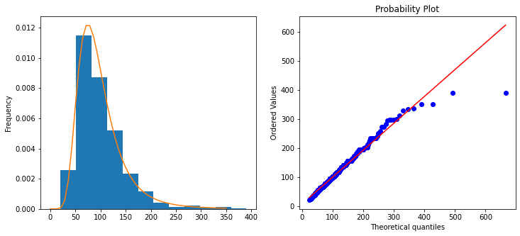
    


```python
Делаем семплирование
```


```python
def ITS(function, n, xlim):
    our_samps = function.ppf(np.random.uniform(size=n))
    fig, ax = plt.subplots(figsize=(10, 6))
    print(min(our_samps),max(our_samps))
    sns.distplot(our_samps, kde=False, norm_hist=True, color='Orange', ax=ax)
    ax.plot(np.linspace(0, xlim), function.pdf(np.linspace(0, xlim)))
    plt.xlim([0, xlim])
```


```python
ITS(scipy.stats.genpareto(*India_genpareto_args), 2000, 150)
```

    1.6826644494576506 140.4939294461809


    /Users/danilshulgan/opt/anaconda3/lib/python3.9/site-packages/seaborn/distributions.py:2619: FutureWarning: `distplot` is a deprecated function and will be removed in a future version. Please adapt your code to use either `displot` (a figure-level function with similar flexibility) or `histplot` (an axes-level function for histograms).
      warnings.warn(msg, FutureWarning)


    
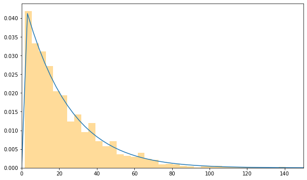
    


```python
ITS(scipy.stats.exponnorm(*France_exponnorm_args), 2000, 200)
```

    8.334365042226857 212.02532831206668


    /Users/danilshulgan/opt/anaconda3/lib/python3.9/site-packages/seaborn/distributions.py:2619: FutureWarning: `distplot` is a deprecated function and will be removed in a future version. Please adapt your code to use either `displot` (a figure-level function with similar flexibility) or `histplot` (an axes-level function for histograms).
      warnings.warn(msg, FutureWarning)


    
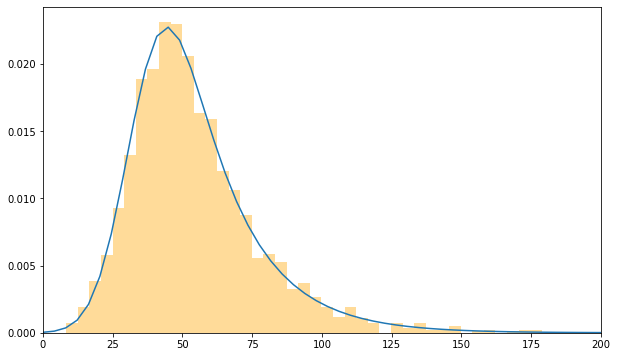
    


```python
ITS(scipy.stats.halfnorm(*Russia_halfnorm_args), 2000, 150)
```

    9.383480505895509 175.82475350650924


    /Users/danilshulgan/opt/anaconda3/lib/python3.9/site-packages/seaborn/distributions.py:2619: FutureWarning: `distplot` is a deprecated function and will be removed in a future version. Please adapt your code to use either `displot` (a figure-level function with similar flexibility) or `histplot` (an axes-level function for histograms).
      warnings.warn(msg, FutureWarning)


    
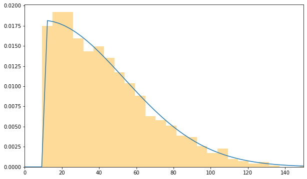
    


```python
ITS(scipy.stats.alpha(*Canada_alpha_args), 2000, 300)
```

    22.929778581738503 493.157142393573


    /Users/danilshulgan/opt/anaconda3/lib/python3.9/site-packages/seaborn/distributions.py:2619: FutureWarning: `distplot` is a deprecated function and will be removed in a future version. Please adapt your code to use either `displot` (a figure-level function with similar flexibility) or `histplot` (an axes-level function for histograms).
      warnings.warn(msg, FutureWarning)


    
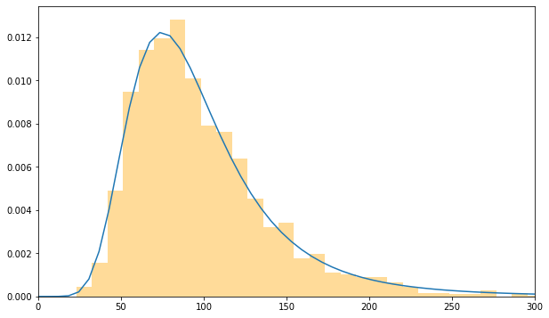
    


```python
def ARS(function, n, xlim):
    samps = scipy.stats.sampling.SimpleRatioUniforms(dist=function)
    our_samps = samps.rvs(n)
    fig, ax = plt.subplots(figsize=(10, 6))
    print(min(our_samps),max(our_samps))
    sns.distplot(our_samps, kde=False, norm_hist=True, color='Orange', ax=ax)
    ax.plot(np.linspace(0, xlim), function.pdf(np.linspace(0, xlim)))
    plt.xlim([0, xlim])
```


```python
ARS(scipy.stats.genpareto(*India_genpareto_args), 2000, 150)
```

    /var/folders/02/7v6725d91y1g8vs6d6gmm1j00000gn/T/ipykernel_71151/3796806765.py:2: RuntimeWarning: [objid: SROU] 22 : mode: try finding it (numerically) => (distribution) incomplete distribution object, entry missing
      samps = scipy.stats.sampling.SimpleRatioUniforms(dist=function)


    1.692683447314966 140.83412342052512


    
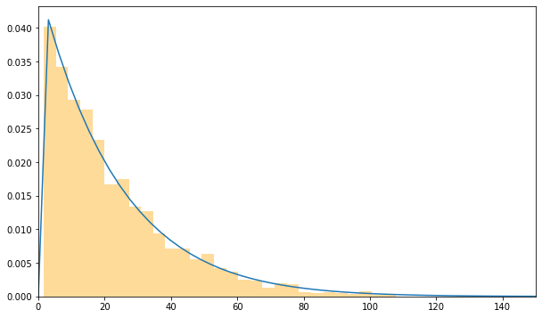
    


```python
ARS(scipy.stats.alpha(*Canada_alpha_args), 2000, 300)
```

    23.713638402832757 594.9396597990453


    /var/folders/02/7v6725d91y1g8vs6d6gmm1j00000gn/T/ipykernel_71151/3796806765.py:2: RuntimeWarning: [objid: SROU] 22 : mode: try finding it (numerically) => (distribution) incomplete distribution object, entry missing
      samps = scipy.stats.sampling.SimpleRatioUniforms(dist=function)
    /Users/danilshulgan/opt/anaconda3/lib/python3.9/site-packages/seaborn/distributions.py:2619: FutureWarning: `distplot` is a deprecated function and will be removed in a future version. Please adapt your code to use either `displot` (a figure-level function with similar flexibility) or `histplot` (an axes-level function for histograms).
      warnings.warn(msg, FutureWarning)


    
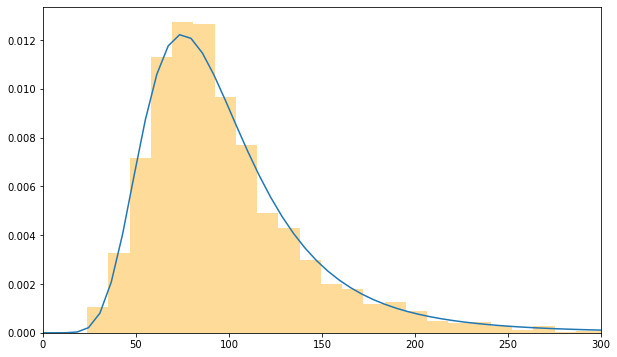
    


```python
ARS(scipy.stats.halfnorm(*Russia_halfnorm_args), 2000, 150)
```

    9.351007173618214 188.32070271550174


    /var/folders/02/7v6725d91y1g8vs6d6gmm1j00000gn/T/ipykernel_71151/3796806765.py:2: RuntimeWarning: [objid: SROU] 22 : mode: try finding it (numerically) => (distribution) incomplete distribution object, entry missing
      samps = scipy.stats.sampling.SimpleRatioUniforms(dist=function)
    /Users/danilshulgan/opt/anaconda3/lib/python3.9/site-packages/seaborn/distributions.py:2619: FutureWarning: `distplot` is a deprecated function and will be removed in a future version. Please adapt your code to use either `displot` (a figure-level function with similar flexibility) or `histplot` (an axes-level function for histograms).
      warnings.warn(msg, FutureWarning)


    
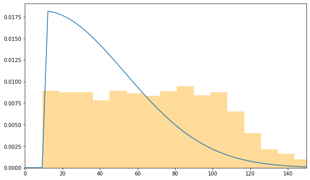
    


```python
ARS(scipy.stats.exponnorm(*France_exponnorm_args), 2000, 200)
```

    2.2487197696172956 195.29978607357523


    /var/folders/02/7v6725d91y1g8vs6d6gmm1j00000gn/T/ipykernel_71151/3796806765.py:2: RuntimeWarning: [objid: SROU] 22 : mode: try finding it (numerically) => (distribution) incomplete distribution object, entry missing
      samps = scipy.stats.sampling.SimpleRatioUniforms(dist=function)
    /Users/danilshulgan/opt/anaconda3/lib/python3.9/site-packages/seaborn/distributions.py:2619: FutureWarning: `distplot` is a deprecated function and will be removed in a future version. Please adapt your code to use either `displot` (a figure-level function with similar flexibility) or `histplot` (an axes-level function for histograms).
      warnings.warn(msg, FutureWarning)


    
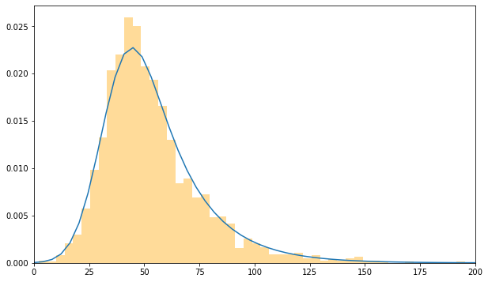
    


```python

```
